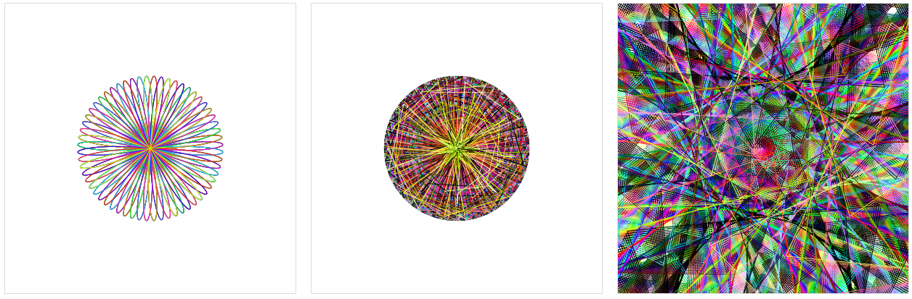
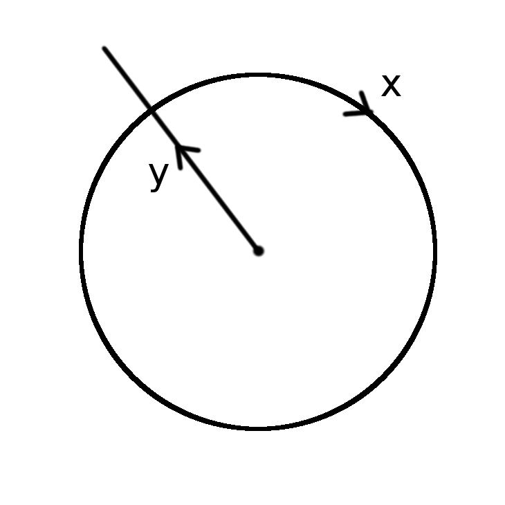

# trippy.js

###[Live Site](http://trippyjs.github.io/trippyjs)

This script is designed to make it really easy to make trippy animations. Just define a small function and it will turn into an animated canvas.
Please make a fork so we can see what cool stuff gets made.

##Quick start
The only file you need to change is script.js. This contains some definitions of Tab objects.
Tab() takes two parameters the first is the number of points or lines you want drawn, the second is a function that is used to draw the animation.
The function will be passed 'n' which is the point/line number and 't' which is the frame or time.
The function should return an object with the following properties:

All properties should be numbers.
- `x` The angle of the point drawn.
- `y` The between the center and the point drawn.
- `h` The hue of the point
- `s` The saturation of the point (0-100)
- `l` The lightness of the point (0-100)

The diagram below explains how to the x and y variables change the position of the point that is drawn.


######Example script.js
```javascript
$(function(){

    Tab(3, function(n, t) {
        var x = t / 100;
        var y = 100 * Math.sin(t / 10);
        var h = t;
        var s = 100;
        var l = 50;
        return {"x": x, "y": y, "h": h, "s": s, "l": l};
    });
});
```
### Browser support
General browser support is evergreen browsers.
Browser features that cause support issues are primarily [flex-box](http://caniuse.com/#feat=requestanimationframe) and [requestAnimationFrame](http://caniuse.com/#feat=flexbox).
